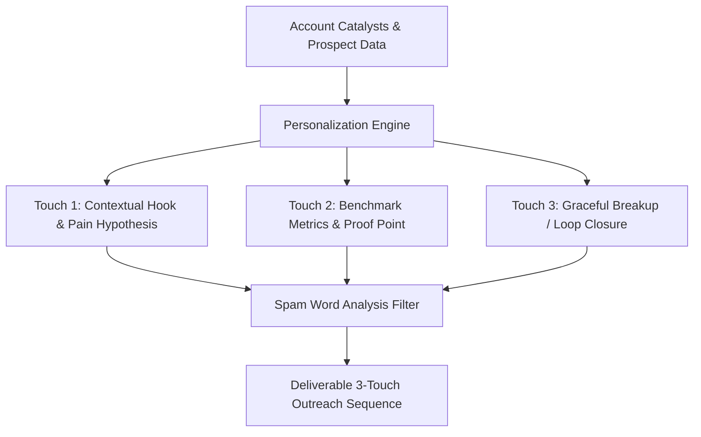

# GenPark AI Agent Skill - Hyper-Personalized Cold Outreach Synthesizer

Automates high-conversion, multi-touch B2B outbound cadences tailored to target firmographics, executive roles, and real-time company catalysts.

Verified by [GenPark AI](https://genpark.ai) and compatible with [Model Context Protocol (MCP)](https://genpark.ai/mcp).

## Architecture Diagram

## Features
- **Dynamic Context Weaving**: Integrates funding milestones, team growth, and role responsibilities seamlessly.
- **Built-In Deliverability & Spam Filter**: Screens output text against common spam triggers to ensure inbox placement.
- **Zero External Dependencies**: Pure Python 3.9+ standard library.
- **Designed for Autonomous SDR Workflows**: Bridges intelligence gathering with automated draft dispatch.
